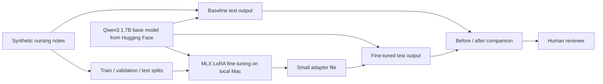

# ESKD Nursing Note Standardizer

This project shows how a small, general language model can be fine-tuned locally to turn short, inconsistent **synthetic** ESKD nursing and care-coordination notes into a clear handoff summary for a human reviewer.

## Use case: standardize nursing-note summaries

Different notes may be brief, fragmented, and written in different styles. Given several notes about one synthetic case, the fine-tuned model produces four consistent sections:

1. Documented observations
2. Care or access items
3. Information to confirm
4. Human-review note

| Before fine-tuning | After fine-tuning |
|---|---|
| A small base model may be vague, unstructured, or miss the requested format. | The same model learns this project's summary format, terminology, and evidence boundary. |

The model does not diagnose, recommend treatment, or replace a nurse, clinician, or reviewer.

## Simplified architecture



## How it runs locally

- **Base model:** [`mlx-community/Qwen3-1.7B-4bit`](https://huggingface.co/mlx-community/Qwen3-1.7B-4bit), a 4-bit MLX version of the Qwen3 1.7B base model, downloaded from Hugging Face.
- **Fine-tuning framework:** [MLX LM](https://github.com/ml-explore/mlx-lm), using a QLoRA adapter on Apple Silicon. The base-model weights are not rewritten.
- **Inference:** MLX LM loads the base model and the trained adapter, then runs the held-out test examples.
- **Deployment:** none in the first phase. This is a local, reproducible demonstration—not a hosted application.
- **Ollama:** not part of this project. It is unnecessary for training or evaluation.

## Data and comparison

All data is invented for this repository. The dataset uses three separate files:

| File | Purpose |
|---|---|
| `data/train.jsonl` | Examples used to train the LoRA adapter. |
| `data/valid.jsonl` | Examples used to check training choices. |
| `data/test.jsonl` | Held-out examples used only for the final before/after comparison. |

The current set contains 36 training, 8 validation, and 12 held-out test examples. Test notes use different wording from training notes and never appear in the training split.

## First local run

The first QLoRA run used 36 synthetic training examples and the 12 held-out test examples. It trained only 2.49 million adapter parameters (about 0.145% of the 1.72B-parameter model) on this laptop.

| Check on held-out examples | Base model | Fine-tuned model |
|---|---:|---:|
| Average required sections present (out of 4) | 0.0 | 4.0 |
| Outputs that spent text on non-empty reasoning before the answer | 11 / 12 | 0 / 12 |

This is a format-and-task demonstration on small synthetic data, not a measurement of clinical performance.

## Project structure

```text
data/                 synthetic train, validation, and test examples
configs/              selected model, training, and evaluation settings
scripts/              generate data, run the baseline, train, and compare outputs
outputs/              saved baseline, fine-tuned, and comparison results (created when run)
README.md             project story and local-run design
```

## What the final demonstration will show

For the same held-out synthetic notes, the repository will show the raw base-model output beside the fine-tuned output and check:

- Were all four summary sections produced?
- Are statements supported by the notes?
- Are missing or conflicting details clearly identified?
- Did the model avoid adding diagnosis or treatment advice?
