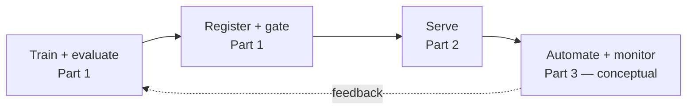

# ESKD Fine-Tuning & MLOps Lab

A local, synthetic-data demonstration of the full small-model lifecycle: fine-tune it, prove it
works, register and gate the result, serve it, and know precisely what a managed pipeline platform
(Vertex AI Pipelines / Kubeflow) would automate on top of that. No client data, no proprietary
logic, not a clinical system.

## Overview

**Domain adaptation for clinical documentation — fine-tuning a small model on
nurse notes drawn from ESKD (End-Stage Kidney Disease) care, with synthetic
data standing in for real records.**

> Background: in diabetes → CKD → ESKD disease progression, nurse notes are a
> key unstructured source for tracking clinical status, treatment adherence,
> and complication risk. This repo is a systematic, synthetic-data validation
> of the full lifecycle needed to turn that kind of text into a fine-tuned
> model — training through serving through the automation a managed pipeline
> platform would add.

**Why fine-tuning instead of RAG/prompting:** nurse notes are dense but
loosely structured — freeform phrasing, abbreviations, domain-specific
terms — so the model needs to internalize the vocabulary and patterns
directly rather than rely on a few examples stuffed into a prompt; that
specialization is what fine-tuning buys over retrieval or prompt engineering
for this kind of highly domain-specific text.

**Core approach:** QLoRA fine-tune a small model, gate promotion on a
held-out before/after comparison, then serve it locally and map every piece
against its managed-pipeline (Vertex AI Pipelines / Kubeflow) equivalent.

| Part | Answers | Status |
|---|---|---|
| [1 — Training](training/README.md) | Can a small model learn a narrow task? | **Built and run** — real QLoRA adapter, held-out before/after comparison, promotion gate + version registry |
| [2 — Serving](serving/README.md) | Can the trained model be served like a product? | **Documented** — Ollama serving mechanics and the local/production maturity ladder |
| [3 — Automation](serving/automation-pipeline.md) | What would a managed pipeline platform add on top of Parts 1 and 2? | **Conceptual mapping** — every hand-built piece named against its Vertex Pipelines/Kubeflow equivalent, deliberately not run |

## Why three parts, one repo

Each part answers a different question in the same lifecycle, so they live together instead of as
separate projects. Part 1 is real, executed work. Part 2 and 3 are honestly labeled by how far they
go — Part 2 is designed but not yet run end to end; Part 3 is intentionally conceptual, because a
single-adapter, single-machine demo has none of the scale problems a managed orchestrator exists to
solve. See [training/docs/concept-review.md](training/docs/concept-review.md) for the author's own
recall notes on the underlying design decisions.
