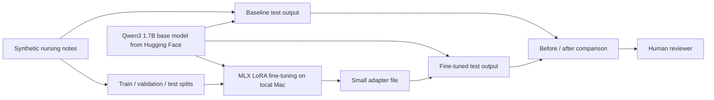

# ESKD Nursing Note Standardizer

This project shows how a small, general language model can be fine-tuned locally to turn short, inconsistent **synthetic** ESKD nursing and care-coordination notes into a clear handoff summary for a human reviewer.

## Use case: standardize nursing-note summaries

Different notes may be brief, fragmented, and written in different styles. Given several notes about one synthetic case, the fine-tuned model produces four consistent sections:

1. Documented observations
2. Care or access items
3. Information to confirm
4. Human-review note

| Before fine-tuning | After fine-tuning |
|---|---|
| A small base model may be vague, unstructured, or miss the requested format. | The same model learns this project's summary format, terminology, and evidence boundary. |

The model does not diagnose, recommend treatment, or replace a nurse, clinician, or reviewer.

## Simplified architecture



## How it runs locally

- **Base model:** [`mlx-community/Qwen3-1.7B-4bit`](https://huggingface.co/mlx-community/Qwen3-1.7B-4bit), a 4-bit MLX version of the Qwen3 1.7B base model, downloaded from Hugging Face.
- **Fine-tuning framework:** [MLX LM](https://github.com/ml-explore/mlx-lm), using a QLoRA adapter on Apple Silicon. The base-model weights are not rewritten.
- **Inference:** MLX LM loads the base model and the trained adapter, then runs the held-out test examples.
- **Deployment:** none in the first phase. This is a local, reproducible demonstration—not a hosted application.
- **Ollama:** not part of this project. It is unnecessary for training or evaluation.

## Data and comparison

All data is invented for this repository. The dataset uses three separate files:

| File | Purpose |
|---|---|
| `data/train.jsonl` | Examples used to train the LoRA adapter. |
| `data/valid.jsonl` | Examples used to check training choices. |
| `data/test.jsonl` | Held-out examples used only for the final before/after comparison. |

The current set contains 36 training, 8 validation, and 12 held-out test examples. Test notes use different wording from training notes and never appear in the training split.

## First local run

The first QLoRA run used 36 synthetic training examples and the 12 held-out test examples. It trained only 2.49 million adapter parameters (about 0.145% of the 1.72B-parameter model) on this laptop.

| Check on held-out examples | Base model | Fine-tuned model |
|---|---:|---:|
| Average required sections present (out of 4) | 0.0 | 4.0 |
| Outputs that spent text on non-empty reasoning before the answer | 11 / 12 | 0 / 12 |

This is a format-and-task demonstration on small synthetic data, not a measurement of clinical performance.

## Same notes, before and after fine-tuning

The examples below use the same test notes and the same prompt. The only change is whether the QLoRA adapter is loaded. Baseline output is shown as generated and truncated at the 256-token limit.

<details>
<summary><strong>Example 1 — unclear visit location</strong></summary>

**Synthetic notes**

```text
The patient said they did not know which site to go to.
Staff sent a message with the visit location.
There is no record that the location message was acknowledged.
```

**Before fine-tuning**

```text
<think>
Okay, let me try to figure out how to approach this. The user wants a
concise ESKD care handoff with specific headings ... First, I need to look
at the provided information ...
[generation ended before a handoff was produced]
```

**After fine-tuning**

```text
Documented observations
- The patient stated they were not informed which site to visit.
- A location visit message was sent, but no acknowledgment of receipt was documented.

Care or access items
- Attendance of the visit is pending because receipt of the location message was not confirmed.

Information to confirm
- Confirm that the location visit was received and acknowledged.

Human-review note
- Please follow up on location visit acknowledgment.
```

</details>

<details>
<summary><strong>Example 2 — appointment change request</strong></summary>

**Synthetic notes**

```text
The patient requested a different appointment time.
Scheduling received the request, but the replacement time was not recorded.
The record does not show a response from scheduling.
```

**Before fine-tuning**

```text
<think>
Okay, let me try to figure out how to approach this ... For Care or access
items, maybe there is a need for a replacement time, but the record does not
have it ...
[generation ended before a handoff was produced]
```

**After fine-tuning**

```text
Documented observations
- The patient requested a different appointment time.
- A replacement time was not recorded.

Care or access items
- Scheduling received the request.

Information to confirm
- Confirm the updated appointment time and whether it was communicated to the patient.

Human-review note
- Please review the unresolved scheduling request.
```

</details>

<details>
<summary><strong>Example 3 — interpreter request</strong></summary>

**Synthetic notes**

```text
The patient requested language interpretation for the next appointment.
A request for an interpreter was entered.
The record does not confirm that an interpreter is available.
```

**Before fine-tuning**

```text
<think>
Okay, the user wants a concise ESKD care handoff with specific headings ...
Let me start by breaking down each section ...
[generation ended before a handoff was produced]
```

**After fine-tuning**

```text
Documented observations
- The patient requested language interpretation for the next appointment.
- A request for an interpreter was entered.

Care or access items
- The record does not confirm that an interpreter is available.

Information to confirm
- Confirm interpreter availability and communicate the result before the next appointment.

Human-review note
- Please review and resolve the pending interpreter request.
```

</details>

## Project structure

```text
data/                 synthetic train, validation, and test examples
configs/              selected model, training, and evaluation settings
scripts/              generate data, run the baseline, train, and compare outputs
outputs/              saved baseline, fine-tuned, and comparison results (created when run)
README.md             project story and local-run design
```

## Next reference

- [Fine-tuning MLOps and advanced scope reference](fine-tuning-advanced-reference.md) — the nine-step QLoRA promotion path, the MLOps/LLMOps/AgenticOps operating model, and the boundary between this method and other fine-tuning types.

## What the demonstration shows — and how each check is done

For the same held-out synthetic notes, the repository shows the raw base-model output beside the fine-tuned output.

**Automated** (`scripts/compare_outputs.py`, summarized in `outputs/comparison.json`):
- Were all four summary sections produced?
- Did the model avoid leaking `<think>` reasoning into the final answer?

**Manually reviewed** on the three examples above — not yet scored by code:
- Are statements supported by the notes?
- Are missing or conflicting details clearly identified?
- Did the model avoid adding diagnosis or treatment advice?

`configs/evaluation.yaml` lists all five checks as the target evaluation surface. Closing the gap between the two automated checks and the three manually-reviewed ones — for example with an LLM-judge rubric — is the natural next step before this method could support a promotion gate.
