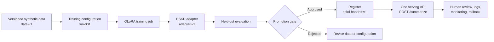
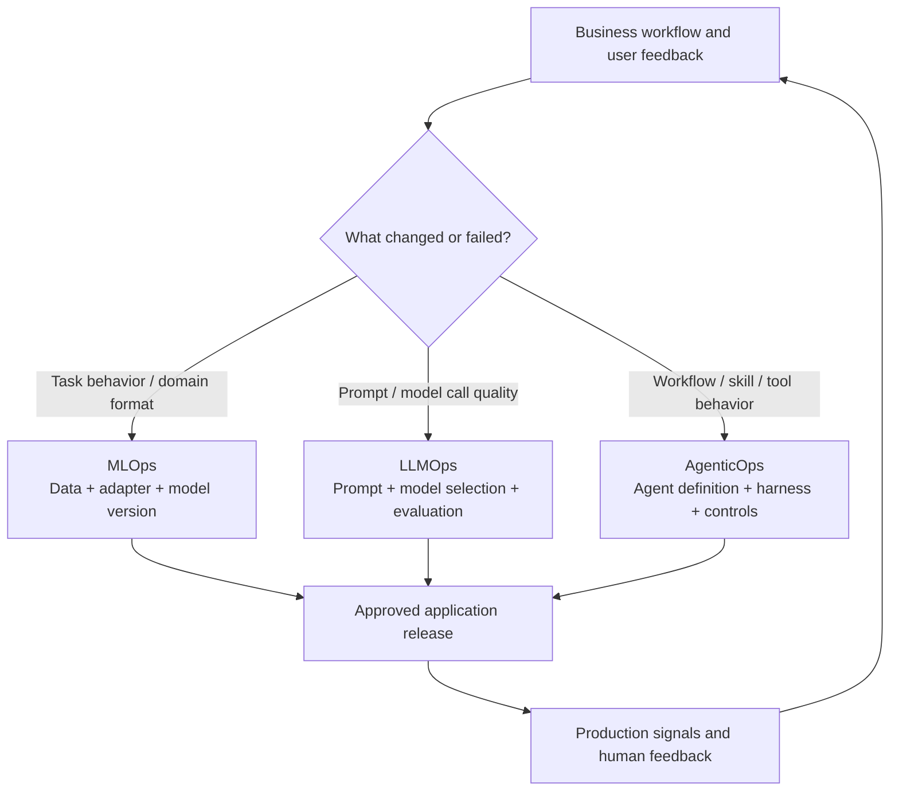
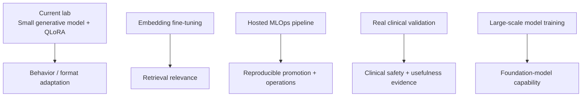

# Fine-Tuning — Advanced Scope Reference

## What this lab already proves

This project has completed the right **foundation** for a public-safe fine-tuning showcase:

- a narrow, repeatable task: standardizing synthetic ESKD nursing-note handoffs;
- separated train, validation, and held-out test data;
- local QLoRA / LoRA adapter training on a small base model;
- baseline versus tuned comparison on unseen synthetic examples;
- an explicit human-review and non-clinical boundary.

This is a real training and evaluation workflow. It is not merely a conceptual diagram.

## The concrete MLOps story for this lab

This lab uses one mainstream fine-tuning pattern: **QLoRA**. It keeps the 1.7B base-model weights unchanged and trains a small adapter. The adapter plus the base model is the approved fine-tuned model version.



The API consumer calls one approved endpoint. It does not need to know whether the service internally uses a base model, an adapter, or a merged model file.

| Step | Concrete object in this project | Why MLOps cares |
|---|---|---|
| 1. Freeze the input | `data/train.jsonl`, `valid.jsonl`, and `test.jsonl` | A later result must be traceable to the exact data split used. |
| 2. Freeze the recipe | Base-model ID, QLoRA settings, training script, and random seed | The training run must be reproducible. |
| 3. Train | Local QLoRA job today; hosted custom training job later | Produces an adapter artifact, not a clinical claim. |
| 4. Evaluate | Same held-out notes before and after fine-tuning | Checks format, evidence support, missing-information handling, and unsafe additions. |
| 5. Promote or reject | Human review of results against stated thresholds | Prevents “a training run completed” from becoming “a model is approved.” |
| 6. Register the version | `eskd-handoff:v1 = base-model + adapter-v1 + evaluation record` | Makes the approved combination identifiable and reversible. |
| 7. Serve | One `/summarize` API loads the approved version | Clients use one stable interface. |
| 8. Monitor and roll back | Capture failures and retain the prior approved version | A poor new version can be withdrawn without changing client integrations. |

### The deployment mental model

```text
Before fine-tuning
  eskd-handoff:v0 = base model only

After evaluation and approval
  eskd-handoff:v1 = same base model + ESKD adapter v1

Client behavior
  POST /summarize   (unchanged)
```

The service is updated to load `v1`. The base-model files may remain cached, but the **effective model version** changes because the adapter changes the model's behavior. If `v1` fails its monitoring or human-review criteria, the service can return to `v0` or the previous approved version.

## A nine-step MLOps teaching framework

There is no single official nine-step standard. This is a practical framework for explaining the complete lifecycle of this fine-tuning use case from business need through operation.

| Step | Question | Fine-tuning artifact or decision |
|---:|---|---|
| 1. Define the business task | What repeated decision or output needs improvement? | Synthetic ESKD handoff standardization; human review remains required. |
| 2. Select the base model | What model fits capability, cost, licensing, and runtime constraints? | Small 1.7B Qwen base model for a local demonstration. |
| 3. Prepare and version data | What examples teach the task, and which examples remain unseen? | Separate synthetic train, validation, and test splits. |
| 4. Define the training recipe | Exactly how will the model be adapted? | QLoRA method, adapter settings, model revision, seed, and run configuration. |
| 5. Run and record training | What happened during the training job? | Run ID, data version, configuration, metrics, adapter artifact, and logs. |
| 6. Evaluate | Is the candidate better on held-out examples and within defined boundaries? | Before/after comparison, format checks, evidence support review, and unsafe-addition checks. |
| 7. Register and approve | Which exact artifact is permitted for use? | `eskd-handoff:v1` links base model, adapter, evaluation record, and approval. |
| 8. Deploy or serve | How do approved clients obtain the result? | One stable `/summarize` API loads the approved base-model-plus-adapter version. |
| 9. Operate and improve | What is observed after release, and what triggers a new version or rollback? | Quality signals, cost/latency, human feedback, incidents, rollback, and approved new data. |

The first six steps create evidence for a release. Steps seven through nine govern that release after training has finished.

## Inside steps 5 and 6: what one iteration does, and how a full run is monitored

The table above describes step 5 ("run and record training") and step 6 ("evaluate") at the level of an MLOps checklist. This section drops one level down: what a single training iteration actually does, and what the full run looks like end to end, using this project's real configuration in `outputs/adapters/adapter_config.json`.

### One iteration, mechanically

Each iteration processes one training example (`batch_size: 1` in this run) through five steps:

1. **Load a batch** — one nursing-note example from `data/train.jsonl`.
2. **Forward pass** — the model (frozen base weights plus the current adapter) generates its guess at the four-section summary.
3. **Compute loss** — the guess is compared, token by token, against the target summary. Because `mask_prompt: true`, loss is computed only on the completion tokens, not the input notes.
4. **Backward pass** — gradients are computed only for the adapter's rank-8 `A`/`B` matrices on the last 8 of 28 layers. The frozen base weights are excluded from this step entirely; they never receive a gradient.
5. **Optimizer step** — the adapter's weights are nudged by a small amount, sized by the learning rate (`1e-5` in this run).

This same five-step loop repeats once per iteration. Nothing changes about the loop between iteration 1 and iteration 250 except the current values of the adapter weights and which example is in the batch.

### What the full 250-iteration run looks like

| Config value | What it controls | This run's number |
|---|---|---|
| `iters` | total iterations | 250 |
| `batch_size` | examples per iteration | 1 |
| training set size | — | 36 examples |
| `steps_per_report` | how often training loss is printed | every 10 steps |
| `save_every` | how often an adapter checkpoint is written | every 100 steps |
| `steps_per_eval` | how often the validation set is scored | every 200 steps |

With `batch_size: 1` and 36 training examples, one epoch (one full pass over the training set) is 36 iterations. 250 iterations therefore covers **250 ÷ 36 ≈ 6.9 epochs** — not 250 epochs. The two checkpoint files in `outputs/adapters/` (`0000100_adapters.safetensors`, `0000200_adapters.safetensors`) are not two different adapters; they are two snapshots of the same rank-8 `A`/`B` matrices at iteration 100 and iteration 200.

### Picking a checkpoint: training loss is not the selection criterion

Training loss measures how well the current adapter reproduces the training examples it has already seen, repeatedly. It is expected to trend down, with noise, since `batch_size: 1` means every step's gradient direction comes from a single example. A falling training loss does not by itself confirm the adapter generalizes — with only 36 examples, it is entirely possible for training loss to keep falling while held-out performance plateaus or regresses.

The signal that actually matters for checkpoint selection is the held-out score in `outputs/comparison.json`, computed on `data/test.jsonl` — data the adapter never trains on — not the training loss curve. As noted earlier in this document, `compare_outputs.py` automates two of the five checks listed in `configs/evaluation.yaml` (required-section presence, absence of leaked `<think>` reasoning); the remaining three are reviewed manually on the examples shown in the README. Checkpoint selection follows that held-out signal, not training loss.

## One product, three operational lifecycles

A modern AI application can change at more than one layer. MLOps, LLMOps, and AgenticOps are useful labels for governing those different layers. They overlap in practice; the important point is to know **which asset changed and which evaluation gate applies**.

| Lifecycle | Primary changing asset | Typical examples | Primary question |
|---|---|---|---|
| **MLOps** | Training data, model weights, adapter, model artifact | QLoRA adapter v1 → adapter v2 | Does the changed model perform better and remain safe enough to promote? |
| **LLMOps** | Prompt, model selection, generation settings, evaluation policy | New system prompt; model-provider change; temperature limit | Does the model call remain accurate, reliable, safe, and cost-effective? |
| **AgenticOps** | Workflow, skills, tool permissions, routing, Markdown/YAML instructions, harness code | New agent skill; changed approval route; new tool policy | Does the workflow complete the business task with the right controls and human oversight? |



### The flywheel is not automatically model retraining

The flywheel means collecting evidence from real use, reviewing it, and improving the correct layer through an approved change process.

| Signal from use | Likely improvement path |
|---|---|
| Summaries consistently omit a domain-specific pattern | Curate approved examples and consider a new adapter version through **MLOps**. |
| Output is too verbose or ignores a formatting instruction | Improve the prompt or generation policy through **LLMOps**. |
| The system calls the wrong tool or skips a required human approval | Change the workflow, skill, or policy through **AgenticOps**. |
| New knowledge or a changing policy is missing | Update the approved knowledge source or retrieval layer; do not automatically retrain the model. |

For a traditional enterprise workflow, AgenticOps and LLMOps may be the primary focus because the business process, tools, approval path, and prompts change most often. For an AI product with repeated domain behavior, MLOps becomes more central when new approved data justifies a new model or adapter version. The same product may need all three, but each change should be evaluated and promoted through the lifecycle that matches the asset being changed.

## Interview explanation

> I view MLOps, LLMOps, and AgenticOps as connected operational lifecycles rather than separate technologies. MLOps governs changes to data and model artifacts; LLMOps governs model calls and prompts; AgenticOps governs the workflow, skills, and tool controls. Feedback from production should be triaged to the right layer. In this lab, the central artifact is a QLoRA adapter, so the detailed lifecycle is MLOps: versioned data, training configuration, evaluation, registration, approval, serving, monitoring, and rollback.

## Fine-tuning map: current lab versus future learning

| Fine-tuning style | What changes | Current status | Appropriate next step |
|---|---|---|---|
| **QLoRA / LoRA** | A small adapter is trained while base weights remain frozen. | **Completed in this lab.** | Extend with hosted MLOps promotion controls. |
| **Full fine-tuning** | Some or all base-model weights are updated. | Not implemented. | Learn conceptually; use only when adapter tuning cannot meet a justified need. |
| **Instruction fine-tuning** | Examples teach a desired task or response style. | This is the task style used by the ESKD lab. | Continue improving synthetic-data diversity and evaluation. |
| **Embedding fine-tuning** | An embedding/retrieval model learns query-to-document relevance. | Not implemented; separate problem type. | Build a separate retrieval-focused lab later, with retrieval metrics. |
| **Continued pre-training / foundation-model training** | General model weights learn from a huge corpus. | Not implemented and out of scope. | Understand the category and vendor-selection implications. |

The point is not to claim every form of fine-tuning. The point is to be able to explain which method fits the task, what artifact it produces, how it is evaluated, and how it is governed after training.

## What it does not claim—and why that is correct

The remaining topics are adjacent but distinct production capabilities. They should not be claimed merely because this small local SFT lab exists.

| Advanced topic | What it is | Why it is different from this lab |
|---|---|---|
| **Embedding fine-tuning** | Train a retriever/embedding model so relevant documents rank nearer to a query. | It improves retrieval quality, not the response format or behavior of a generative model. |
| **Large-scale foundation-model training** | Train or continue pre-train a model over a very large corpus and compute cluster. | This requires massive datasets, distributed training, safety research, and substantial compute; it is usually a model-provider responsibility. |
| **Real clinical-data validation** | Validate a clinical use case with approved data, clinical experts, protocol, governance, and safety monitoring. | Synthetic before/after output cannot establish clinical quality, safety, or workflow effectiveness. |
| **Hosted MLOps fine-tuning pipeline** | Reproducible cloud training, evaluation gates, registry, deployment, monitoring, and rollback. | The current lab runs locally and intentionally has no deployment or managed-model lifecycle. |

## The right mental model



These are complementary layers, not a single maturity ladder. A strong enterprise system may use several of them, but does not need all of them.

## Recommended next learning order

### 1. Hosted fine-tuning / MLOps lifecycle — learn first

This is the most directly relevant extension for a Principal AI Engineer because it connects an already-understood QLoRA experiment to enterprise operations.

Understand the lifecycle before implementing a cloud version:

```text
approved dataset version
  -> training configuration version
  -> managed training job
  -> evaluation on held-out set
  -> quality / safety gate
  -> model or adapter registry
  -> staged deployment
  -> monitoring, feedback, rollback
```

For Vertex AI, the equivalents are typically dataset/artifact versioning, a training job or custom job, model registry, endpoint or batch serving, monitoring, IAM, logs, and evaluation metadata. The exact managed service matters less than the lifecycle controls.

### 2. Embedding fine-tuning — learn second

Use this only when a retrieval problem is demonstrated:

```text
question
  -> embedding model
  -> vector search / reranking
  -> relevant evidence
  -> LLM answer with citations
```

The training data is usually a set of query–relevant-document pairs, often with hard negatives. The evaluation is retrieval-oriented: Recall@k, MRR, nDCG, or task success—not merely fluent generated text.

### 3. Real clinical validation — understand the boundary, do not simulate it

For a real healthcare implementation, the work would require approved data access, de-identification/minimum-necessary review, a clinical ground truth or review protocol, subgroup/safety analysis, human oversight, and post-deployment monitoring. This lab should continue to say: **synthetic data only; not clinical validation**.

### 4. Foundation-model training — know the category, not the implementation

You should be able to distinguish it from fine-tuning:

> Fine-tuning adapts an existing model to a bounded task using curated examples. Foundation-model training builds general capability from an enormous corpus. In enterprise delivery, I would typically select and govern a foundation model rather than train one from scratch.

## Next MLOps implementation step

The MLOps promotion plan is now documented above. Do not add a second large model experiment immediately. The next implementation step is to turn the plan into a small hosted proof of concept that records:

- dataset version and approval record;
- training configuration and base-model version;
- held-out evaluation thresholds;
- adapter/model artifact registry entry;
- human sign-off for promotion;
- staged deployment, monitoring, and rollback decision.

That artifact strengthens the interview story without pretending that a synthetic notebook has become a clinical production system.

## Fine-tuning scope interview explanation

> This lab proves the local SFT foundation: curated splits, QLoRA adaptation, and held-out before/after evaluation on a narrow synthetic task. I distinguish that from embedding fine-tuning for retrieval, from managed MLOps for governed promotion, and from clinical validation, which needs approved real-world data and expert review. I do not collapse those claims into one.

## Completion checklist for the next phase

- [x] Add an MLOps promotion plan for the existing SFT experiment
- [ ] Define promotion gates: format, evidence support, safety, cost, latency
- [ ] Define artifact/version metadata to retain
- [ ] Define staged-release and rollback signals
- [ ] Add an embedding fine-tuning concept note only after selecting a real retrieval use case
