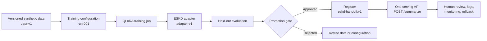
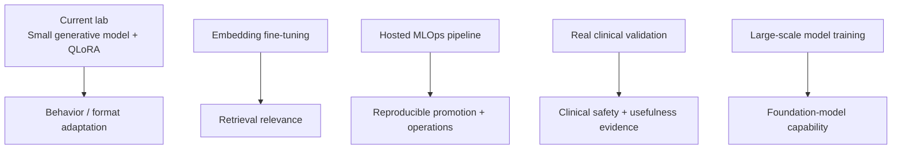

# Fine-Tuning — Advanced Scope Reference

## What this lab already proves

This project has completed the right **foundation** for a public-safe fine-tuning showcase:

- a narrow, repeatable task: standardizing synthetic ESKD nursing-note handoffs;
- separated train, validation, and held-out test data;
- local QLoRA / LoRA adapter training on a small base model;
- baseline versus tuned comparison on unseen synthetic examples;
- an explicit human-review and non-clinical boundary.

This is a real training and evaluation workflow. It is not merely a conceptual diagram.

## The concrete MLOps story for this lab

This lab uses one mainstream fine-tuning pattern: **QLoRA**. It keeps the 1.7B base-model weights unchanged and trains a small adapter. The adapter plus the base model is the approved fine-tuned model version.



The API consumer calls one approved endpoint. It does not need to know whether the service internally uses a base model, an adapter, or a merged model file.

| Step | Concrete object in this project | Why MLOps cares |
|---|---|---|
| 1. Freeze the input | `data/train.jsonl`, `valid.jsonl`, and `test.jsonl` | A later result must be traceable to the exact data split used. |
| 2. Freeze the recipe | Base-model ID, QLoRA settings, training script, and random seed | The training run must be reproducible. |
| 3. Train | Local QLoRA job today; hosted custom training job later | Produces an adapter artifact, not a clinical claim. |
| 4. Evaluate | Same held-out notes before and after fine-tuning | Checks format, evidence support, missing-information handling, and unsafe additions. |
| 5. Promote or reject | Human review of results against stated thresholds | Prevents “a training run completed” from becoming “a model is approved.” |
| 6. Register the version | `eskd-handoff:v1 = base-model + adapter-v1 + evaluation record` | Makes the approved combination identifiable and reversible. |
| 7. Serve | One `/summarize` API loads the approved version | Clients use one stable interface. |
| 8. Monitor and roll back | Capture failures and retain the prior approved version | A poor new version can be withdrawn without changing client integrations. |

### The deployment mental model

```text
Before fine-tuning
  eskd-handoff:v0 = base model only

After evaluation and approval
  eskd-handoff:v1 = same base model + ESKD adapter v1

Client behavior
  POST /summarize   (unchanged)
```

The service is updated to load `v1`. The base-model files may remain cached, but the **effective model version** changes because the adapter changes the model's behavior. If `v1` fails its monitoring or human-review criteria, the service can return to `v0` or the previous approved version.

## Fine-tuning map: current lab versus future learning

| Fine-tuning style | What changes | Current status | Appropriate next step |
|---|---|---|---|
| **QLoRA / LoRA** | A small adapter is trained while base weights remain frozen. | **Completed in this lab.** | Extend with hosted MLOps promotion controls. |
| **Full fine-tuning** | Some or all base-model weights are updated. | Not implemented. | Learn conceptually; use only when adapter tuning cannot meet a justified need. |
| **Instruction fine-tuning** | Examples teach a desired task or response style. | This is the task style used by the ESKD lab. | Continue improving synthetic-data diversity and evaluation. |
| **Embedding fine-tuning** | An embedding/retrieval model learns query-to-document relevance. | Not implemented; separate problem type. | Build a separate retrieval-focused lab later, with retrieval metrics. |
| **Continued pre-training / foundation-model training** | General model weights learn from a huge corpus. | Not implemented and out of scope. | Understand the category and vendor-selection implications. |

The point is not to claim every form of fine-tuning. The point is to be able to explain which method fits the task, what artifact it produces, how it is evaluated, and how it is governed after training.

## What it does not claim—and why that is correct

The remaining topics are adjacent but distinct production capabilities. They should not be claimed merely because this small local SFT lab exists.

| Advanced topic | What it is | Why it is different from this lab |
|---|---|---|
| **Embedding fine-tuning** | Train a retriever/embedding model so relevant documents rank nearer to a query. | It improves retrieval quality, not the response format or behavior of a generative model. |
| **Large-scale foundation-model training** | Train or continue pre-train a model over a very large corpus and compute cluster. | This requires massive datasets, distributed training, safety research, and substantial compute; it is usually a model-provider responsibility. |
| **Real clinical-data validation** | Validate a clinical use case with approved data, clinical experts, protocol, governance, and safety monitoring. | Synthetic before/after output cannot establish clinical quality, safety, or workflow effectiveness. |
| **Hosted MLOps fine-tuning pipeline** | Reproducible cloud training, evaluation gates, registry, deployment, monitoring, and rollback. | The current lab runs locally and intentionally has no deployment or managed-model lifecycle. |

## The right mental model



These are complementary layers, not a single maturity ladder. A strong enterprise system may use several of them, but does not need all of them.

## Recommended next learning order

### 1. Hosted fine-tuning / MLOps lifecycle — learn first

This is the most directly relevant extension for a Principal AI Engineer because it connects an already-understood QLoRA experiment to enterprise operations.

Understand the lifecycle before implementing a cloud version:

```text
approved dataset version
  -> training configuration version
  -> managed training job
  -> evaluation on held-out set
  -> quality / safety gate
  -> model or adapter registry
  -> staged deployment
  -> monitoring, feedback, rollback
```

For Vertex AI, the equivalents are typically dataset/artifact versioning, a training job or custom job, model registry, endpoint or batch serving, monitoring, IAM, logs, and evaluation metadata. The exact managed service matters less than the lifecycle controls.

### 2. Embedding fine-tuning — learn second

Use this only when a retrieval problem is demonstrated:

```text
question
  -> embedding model
  -> vector search / reranking
  -> relevant evidence
  -> LLM answer with citations
```

The training data is usually a set of query–relevant-document pairs, often with hard negatives. The evaluation is retrieval-oriented: Recall@k, MRR, nDCG, or task success—not merely fluent generated text.

### 3. Real clinical validation — understand the boundary, do not simulate it

For a real healthcare implementation, the work would require approved data access, de-identification/minimum-necessary review, a clinical ground truth or review protocol, subgroup/safety analysis, human oversight, and post-deployment monitoring. This lab should continue to say: **synthetic data only; not clinical validation**.

### 4. Foundation-model training — know the category, not the implementation

You should be able to distinguish it from fine-tuning:

> Fine-tuning adapts an existing model to a bounded task using curated examples. Foundation-model training builds general capability from an enormous corpus. In enterprise delivery, I would typically select and govern a foundation model rather than train one from scratch.

## Suggested next artifact for this repository

Do not add a second large implementation immediately. First add a concise **MLOps promotion plan** that maps this existing local experiment to a hosted lifecycle:

- dataset version and approval record;
- training configuration and base-model version;
- held-out evaluation thresholds;
- adapter/model artifact registry entry;
- human sign-off for promotion;
- staged deployment, monitoring, and rollback decision.

That artifact strengthens the interview story without pretending that a synthetic notebook has become a clinical production system.

## Interview explanation

> This lab proves the local SFT foundation: curated splits, QLoRA adaptation, and held-out before/after evaluation on a narrow synthetic task. I distinguish that from embedding fine-tuning for retrieval, from managed MLOps for governed promotion, and from clinical validation, which needs approved real-world data and expert review. I do not collapse those claims into one.

## Completion checklist for the next phase

- [ ] Add an MLOps promotion-plan document for the existing SFT experiment
- [ ] Define promotion gates: format, evidence support, safety, cost, latency
- [ ] Define artifact/version metadata to retain
- [ ] Define staged-release and rollback signals
- [ ] Add an embedding fine-tuning concept note only after selecting a real retrieval use case
