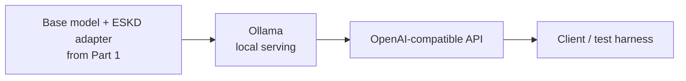

# ESKD Inference Serving — Part 2 of 3

> **Synthetic demonstration only.** No client data, proprietary logic, or production code.

**[Part 1 — training](../training/README.md)** trains a QLoRA adapter that turns short, inconsistent
synthetic ESKD nursing notes into a standardized handoff summary, and registers approved versions.
**This part** takes that trained adapter and answers the next question: how do you actually serve it?
**[Part 3 — automation](automation-pipeline.md)** answers what a managed platform (Vertex Pipelines /
Kubeflow) would add on top of the manual steps in Parts 1 and 2.

## What this shows

| | Part 1 | Part 2 (this lab) |
|---|---|---|
| Question answered | Can a small model learn this task? | Can the trained model be served like a product? |
| Artifact | QLoRA adapter | A running local API |
| How it's used | `mlx_lm.generate()`, a one-off script | `POST` request, any client |

## Architecture

## Tooling choices — and why

| Tool | Role in this lab | Why |
|---|---|---|
| **Ollama** | Actually runs the service | Native Apple Silicon support; the standard tool for local/single-user serving — matches this lab's real hardware (a CPU Mac, no GPU) |
| **vLLM** | Not run here — documented only | Solves a different problem: high-throughput, multi-tenant serving on data-center GPUs. Running it on a CPU laptop would prove nothing about the reason it exists. See [inference-serving-reference.md](inference-serving-reference.md) for what it does and when it's the right choice. |
| **Model management / orchestration** (Triton, Vertex Pipelines, Kubeflow) | A lightweight hand-built version exists (Part 1's `promote.py` registry); the managed-platform equivalent is documented, not run | Training's promotion gate plus this lab's manual adapter reload cover the same lifecycle contract a managed pipeline enforces — see [automation-pipeline.md](automation-pipeline.md) for exactly which platform primitive replaces which manual step, and why a managed orchestrator isn't justified for a single adapter. |

## Scope

This is a local, single-machine demonstration. It proves the serving mechanics — a stable
API contract, adapter-aware versioning — work end to end on real hardware. It is not a
throughput benchmark, not a multi-model deployment, and not a clinical system.

## Deeper reference

The full inference-layer knowledge behind this lab — the Ollama/vLLM maturity ladder, KV-cache
and PagedAttention mechanics, continuous batching, multi-LoRA serving, and the model-management
landscape (Triton vs. lighter alternatives) — is in
[inference-serving-reference.md](inference-serving-reference.md).

What a managed pipeline platform would add on top of Parts 1 and 2 — mapped primitive by primitive
to Vertex AI Pipelines / Kubeflow — is in [automation-pipeline.md](automation-pipeline.md).

---
*Synthetic data only. Not a clinical system.*
